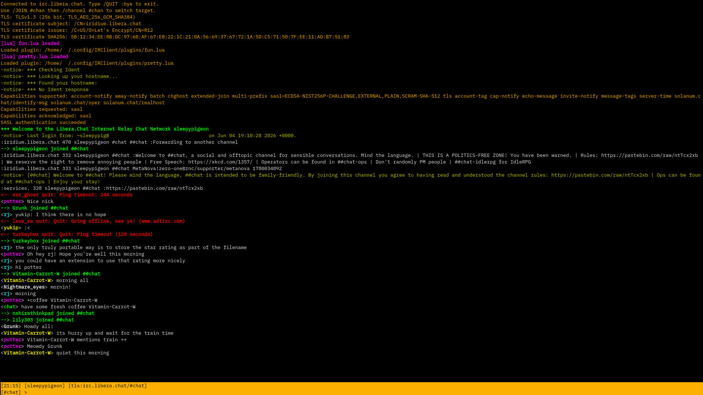

# IRClient

## Screenshot


## What is it?
IRClient is a compact IRC client written in c++.

## Features
IRClient supports the following features:
* ncurses terminal interface,
* TLS support through OpenSSL,
* SASL PLAIN authentication,
* IRC capability negotiation,
* Lua plugin loading,
* Lua hooks for raw lines, messages, notices, joins, parts, quits, CTCP, and custom commands,
* Scrollback buffer,
* **Simple config file under ~/.config/IRClient**.

## Dependencies
* C++17,
* ncurses,
* OpenSSL,
* Lua,
* filesystem support from the C++ standard library.

Arch:
> sudo pacman -S gcc ncurses openssl lua

Debian-like systems:
> sudo apt install g++ libncurses-dev libssl-dev liblua5.4-dev

## Building
> g++ -std=c++17 main.cpp -o irc   $(pkg-config --cflags --libs lua ncurses openssl)

## Running
Without TLS you may run IRClient the following way:
> ./irc IRC.EXAMPLE.NET 6667 NICKNAME '#channel'

With TLS you may run IRClient the following way:
> ./irc IRC.EXAMPLE.NET 6697 NICKNAME '#channel' --tls

You can also store your nickname and authentication details in the config file.
The config file is located under *~/.config/IRClient/auth.conf*
An auth.conf file may look something like this:
  ```ini
  nick=username
  username=username
  realname=username
  sasl_username=username
  sasl_password=yourPasswordHere
  ```

## Plugins
IRClient is so revolutionary and superior that it utilizes Lua plugins and not perl.
Lua plugins live in *~/.config/IRClient/plugins*
Available Lua functions include:
* irc.send(line)
* irc.join(channel)
* irc.privmsg(target, message)
* irc.log(message)
* irc.logStyled(message, color, attr1, attr2)

Example styled log:
> irc.logStyled("plugin loaded", "magenta", "bold")

Supported colors:
> red, green, yellow, blue, magenta, cyan, white

Supported attributes:
> bold, underline, reverse, dim

**An example plugin has been provided in plugins/**

## Commands
Inside IRClient:

```ini
/JOIN #channel
/channel #channel
/QUIT :bye
```
Any other slash command is sent raw to the IRC server. (unless a Lua plugin handles it first)

## License

IRClient is licensed under the GNU General Public License v3.0 or later.
See [LICENSE](LICENSE) for details.
